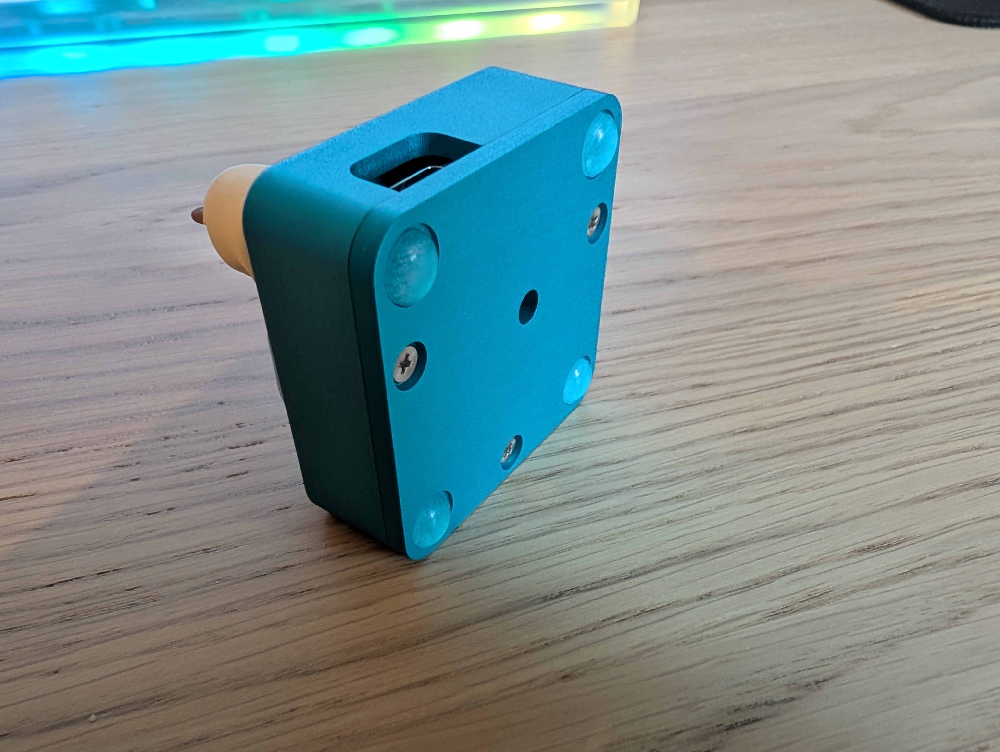

# Ida - 3-key macropad

  
  

  
  

# Bill of Materials

- **2x** 12x1 pin header
- **1x** Diode (_1N4148 DO-35_)
- **1x** Push button for resetting the board (_4x4x1.5mm_)
- **1x** Pro Micro or something with compatible pinout
- **3x** Keyboard switch
- **1x** 2u stabilizer
- **4x** 8mm rubber feet
- **3x** M2.5 screws
- Steady hands

# Getting the parts made

## PCB 

The gerbers are included in the repo in the [kicad](kicad/) directory. You can simply upload the gerbers to a service like JLCPCB.

Not that the entire Kicad project is included so you can also regenerate the gerbers with different settings if needed or adjust the PCB.

## Case

The case was CNC'd out of aluminium (again by JLCPCB). The case is made up of two ([top](top.stl), [bottom](bottom.stl)) parts.

The two parts are held together using 3 M2.5 screws. There is also a [drawing](drawing.pdf) showing the exact placement of the threads.

It might be possible to 3D print the case, but the screw threads might make it difficult.

# Build guide

| a | b |
|---|---|
| **Step 1**: Solder the reset switch and the diode |  |
| 3 | 4 |

**Step 1**: Solder the reset switch and the diode:

**Step 2**: Solder the pin headers:

**Step 3**: Place the stabilizers:

**Step 4**: Place switches in the enclosure:

**Step 5**: Place the PCB inside the enclosure and solder the switches:

**Step 6**: Place and solder the Pro Micro:

**Step 7**: Screw the bottom part of the case:

**Done!**

# Schematic

  
  

